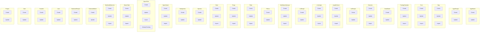
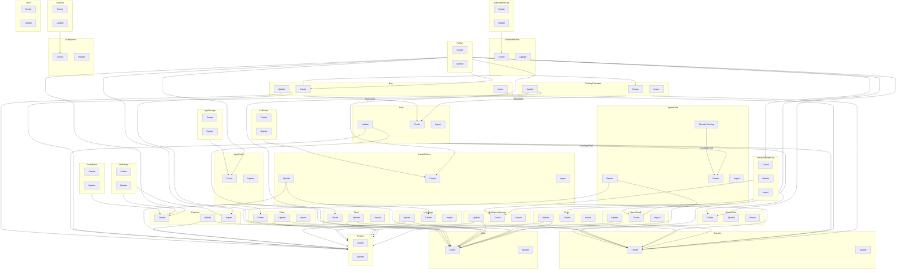

# TODO: DO ALL OF THE OTHERS

```mermaid
flowchart TD
    subgraph AgarBatch
        CreateAgarBatch[Create]
        UpdateAgarBatch[Update]
    end

    subgraph AgarRecipe
        CreateAgarRecipe[Create]
        UpdateAgarRecipe[Update]
    end

    subgraph Bag
        CreateBag[Create]
        UpdateBag[Update]
        ImportBag[Import]
    end

    subgraph Fruit
        CreateFruit[Create]
        UpdateFruit[Update]
        ImportFruit[Import]
    end

    subgraph FruitingChamber
        CreateFruitingChamber[Create]
        UpdateFruitingChamber[Update]
        ImportFruitingChamber[Import]
    end

    subgraph GrainBatch
        CreateGrainBatch[Create]
        UpdateGrainBatch[Update]
    end

    subgraph GrainJar
        CreateGrainJar[Create]
        UpdateGrainJar[Update]
        ImportGrainJar[Import]
    end

    subgraph JarRecipe
        CreateJarRecipe[Create]
        UpdateJarRecipe[Update]
    end

    subgraph LiquidCulture
        CreateLC[Create]
        UpdateLC[Update]
        ImportLC[Import]
    end

    subgraph LcSyringe
        CreateLCS[Create]
        UpdateLCS[Update]
        ImportLCS[Import]
    end

    subgraph LcRecipe
        CreateLCRecipe[Create]
        UpdateLCRecipe[Update]
    end

    subgraph MultiSporeSyringe
        CreateMSS[Create]
        UpdateMSS[Update]
        ImportMSS[Import]
    end

    subgraph PcRun
        CreatePCRun[Create]
        UpdatePCRun[Update]
    end

    subgraph Plate
        CreatePlate[Create]
        UpdatePlate[Update]
        ImportPlate[Import]
    end

    subgraph Plugs
        CreatePlugs[Create]
        UpdatePlugs[Update]
        ImportPlugs[Import]
    end

    subgraph Slant
        CreateSlant[Create]
        UpdateSlant[Update]
        ImportSlant[Import]
    end

    subgraph Species
        CreateSpecies[Create]
        UpdateSpecies[Update]
    end

    subgraph Subspecies
        CreateSubspecies[Create]
        UpdateSubspecies[Update]
    end

    subgraph SporeSwab
        CreateSporeSwab[Create]
        UpdateSporeSwab[Update]
        ImportSporeSwab[Import]
    end

    subgraph SporePrint
        CreateSporePrint[Create]
        UpdateSporePrint[Update]
        ImportSporePrint[Import]
        ExistingSporePrint[Already Existing]
    end

    subgraph StasisTube
        CreateStasisTube[Create]
        UpdateStasisTube[Update]
        ImportStasisTube[Import]
    end

    subgraph SterilizedWaterJar
        CreateWaterJar[Create]
        UpdateWaterJar[Update]
        ImportWaterJar[Import]
    end

    subgraph SubstrateBatch
        CreateSubstrateBatch[Create]
        UpdateSubstrateBatch[Update]
    end

    subgraph SubstrateRecipe
        CreateSubstrateRecipe[Create]
        UpdateSubstrateRecipe[Update]
    end

    subgraph User
        CreateUser[Create]
        UpdateUser[Update]
    end

    subgraph Transfer
        CreateTransfer[Create]
        UpdateTransfer[Update]
    end

    subgraph Sale
        CreateSale[Create]
        UpdateSale[Update]
    end

    subgraph Project
        CreateProject[Create]
        UpdateProject[Update]
    end
```

```mermaid
flowchart TD
    subgraph AgarBatch
        CreateAgarBatch[Create]
        UpdateAgarBatch[Update]
    end
    AgarRecipe --> CreateAgarBatch
    PcRun --> CreateAgarBatch
    subgraph AgarRecipe
        CreateAgarRecipe[Create]
        UpdateAgarRecipe[Update]
    end
    subgraph Bag
        CreateBag[Create]
        UpdateBag[Update]
        ImportBag[Import]
    end
    SubstrateBatch --> CreateBag
    PcRun --> CreateBag
    subgraph Fruit
        CreateFruit[Create]
        UpdateFruit[Update]
        ImportFruit[Import]
    end
    Bag -->|Harvested| CreateFruit
    FruitingChamber -->|Harvested| CreateFruit
    subgraph FruitingChamber
        CreateFruitingChamber[Create]
        UpdateFruitingChamber[Update]
        ImportFruitingChamber[Import]
    end
    SubstrateBatch --> CreateFruitingChamber
    subgraph GrainBatch
        CreateGrainBatch[Create]
        UpdateGrainBatch[Update]
    end
%% TODO: from grains
    subgraph GrainJar
        CreateGrainJar[Create]
        UpdateGrainJar[Update]
        ImportGrainJar[Import]
    end
    GrainBatch --> CreateGrainJar
    JarRecipe --> CreateGrainJar
    PcRun --> CreateGrainJar
    JarRecipe --> ImportGrainJar
    PcRun --> ImportGrainJar
    subgraph JarRecipe
        CreateJarRecipe[Create]
        UpdateJarRecipe[Update]
    end
    subgraph LiquidCulture
        CreateLC[Create]
        UpdateLC[Update]
        ImportLC[Import]
    end
    LcRecipe --> CreateLC
    PcRun --> CreateLC
    subgraph LcSyringe
        CreateLCS[Create]
        UpdateLCS[Update]
        ImportLCS[Import]
    end
    LiquidCulture --> CreateLCS

    subgraph LcRecipe
        CreateLCRecipe[Create]
        UpdateLCRecipe[Update]
    end
    subgraph MultiSporeSyringe
        CreateMSS[Create]
        UpdateMSS[Update]
        ImportMSS[Import]
    end
    SterilizedWaterJar --> CreateMSS
    SporePrint --> CreateMSS

    subgraph PcRun
        CreatePCRun[Create]
        UpdatePCRun[Update]
    end
    subgraph Plate
        CreatePlate[Create]
        UpdatePlate[Update]
        ImportPlate[Import]
    end
    AgarBatch --> CreatePlate
    subgraph Plugs
        CreatePlugs[Create]
        UpdatePlugs[Update]
        ImportPlugs[Import]
    end
    PcRun --> CreatePlugs

    subgraph Slant
        CreateSlant[Create]
        UpdateSlant[Update]
        ImportSlant[Import]
    end
    AgarBatch --> CreateSlant
    subgraph Species
        CreateSpecies[Create]
        UpdateSpecies[Update]
    end
    subgraph Subspecies
        CreateSubspecies[Create]
        UpdateSubspecies[Update]
    end
    Species --> CreateSubspecies
    subgraph SporeSwab
        CreateSporeSwab[Create]
        UpdateSporeSwab[Update]
        ImportSporeSwab[Import]
    end
    Fruit --> CreateSporeSwab
    SporePrint --> CreateSporeSwab
    subgraph SporePrint
        CreateSporePrint[Create]
        UpdateSporePrint[Update]
        ImportSporePrint[Import]
        ExistingSporePrint[Already Existing]
    end
    Fruit -->|Creating Print| CreateSporePrint
    ExistingSporePrint -->|Creating Print| CreateSporePrint
    subgraph StasisTube
        CreateStasisTube[Create]
        UpdateStasisTube[Update]
        ImportStasisTube[Import]
    end
    SterilizedWaterJar --> CreateStasisTube
    PcRun --> CreateStasisTube
    subgraph SterilizedWaterJar
        CreateWaterJar[Create]
        UpdateWaterJar[Update]
        ImportWaterJar[Import]
    end
    PcRun --> SterilizedWaterJar
    subgraph SubstrateBatch
        CreateSubstrateBatch[Create]
        UpdateSubstrateBatch[Update]
    end
    SubstrateRecipe --> CreateSubstrateBatch
    subgraph SubstrateRecipe
        CreateSubstrateRecipe[Create]
        UpdateSubstrateRecipe[Update]
    end
    subgraph User
        CreateUser[Create]
        UpdateUser[Update]
    end
    subgraph Transfer
        CreateTransfer[Create]
        UpdateTransfer[Update]
    end
    SporePrint --> CreateTransfer
    StasisTube --> CreateTransfer
    MultiSporeSyringe --> CreateTransfer
    LcSyringe --> CreateTransfer
    LiquidCulture --> CreateTransfer
    Plugs --> CreateTransfer
    SporeSwab --> CreateTransfer
    Fruit --> CreateTransfer
    Bag --> CreateTransfer
    FruitingChamber --> CreateTransfer

    subgraph Sale
        CreateSale[Create]
        UpdateSale[Update]
    end
    UpdateBag --> CreateSale
    UpdateFruit --> CreateSale
    UpdateFruitingChamber --> CreateSale
    UpdateGrainJar --> CreateSale
    UpdateLC --> CreateSale
    UpdateLCS --> CreateSale
    UpdateMSS --> CreateSale
    UpdatePlate --> CreateSale
    UpdatePlugs --> CreateSale
    UpdateSlant --> CreateSale
    UpdateSporePrint --> CreateSale
    UpdateSporeSwab --> CreateSale

    subgraph Project
        CreateProject[Create]
        UpdateProject[Update]
    end
    UpdateBag --> Project
    UpdateFruit --> Project
    UpdateFruitingChamber --> Project
    UpdateGrainJar --> Project
    UpdateLC --> Project
    UpdateLCS --> Project
    UpdateMSS --> Project
    UpdatePlate --> Project
    UpdatePlugs --> Project
    UpdateSlant --> Project
    UpdateSporePrint --> Project
    UpdateSporeSwab --> Project

```
