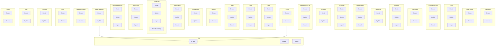

```mermaid
flowchart TD
subgraph AgarBatch
    CreateAgarBatch[Create]
    UpdateAgarBatch[Update]
end

subgraph AgarRecipe
    CreateAgarRecipe[Create]
    UpdateAgarRecipe[Update]
end

subgraph Bag
    CreateBag[Create]
    UpdateBag[Update]
    ImportBag[Import]
end
SubstrateBatch --> CreateBag
PcRun --> CreateBag

subgraph Fruit
    CreateFruit[Create]
    UpdateFruit[Update]
    ImportFruit[Import]
end

subgraph FruitingChamber
    CreateFruitingChamber[Create]
    UpdateFruitingChamber[Update]
    ImportFruitingChamber[Import]
end

subgraph GrainBatch
    CreateGrainBatch[Create]
    UpdateGrainBatch[Update]
end

subgraph GrainJar
    CreateGrainJar[Create]
    UpdateGrainJar[Update]
    ImportGrainJar[Import]
end

subgraph JarRecipe
    CreateJarRecipe[Create]
    UpdateJarRecipe[Update]
end

subgraph LiquidCulture
    CreateLC[Create]
    UpdateLC[Update]
    ImportLC[Import]
end

subgraph LcSyringe
    CreateLCS[Create]
    UpdateLCS[Update]
    ImportLCS[Import]
end

subgraph LcRecipe
    CreateLCRecipe[Create]
    UpdateLCRecipe[Update]
end

subgraph MultiSporeSyringe
    CreateMSS[Create]
    UpdateMSS[Update]
    ImportMSS[Import]
end

subgraph PcRun
    CreatePCRun[Create]
    UpdatePCRun[Update]
end

subgraph Plate
    CreatePlate[Create]
    UpdatePlate[Update]
    ImportPlate[Import]
end

subgraph Plugs
    CreatePlugs[Create]
    UpdatePlugs[Update]
    ImportPlugs[Import]
end

subgraph Slant
    CreateSlant[Create]
    UpdateSlant[Update]
    ImportSlant[Import]
end

subgraph Species
    CreateSpecies[Create]
    UpdateSpecies[Update]
end

subgraph Subspecies
    CreateSubspecies[Create]
    UpdateSubspecies[Update]
end

subgraph SporeSwab
    CreateSporeSwab[Create]
    UpdateSporeSwab[Update]
    ImportSporeSwab[Import]
end

subgraph SporePrint
    CreateSporePrint[Create]
    UpdateSporePrint[Update]
    ImportSporePrint[Import]
    ExistingSporePrint[Already Existing]
end

subgraph StasisTube
    CreateStasisTube[Create]
    UpdateStasisTube[Update]
    ImportStasisTube[Import]
end

subgraph SterilizedWaterJar
    CreateWaterJar[Create]
    UpdateWaterJar[Update]
    ImportWaterJar[Import]
end

subgraph SubstrateBatch
    CreateSubstrateBatch[Create]
    UpdateSubstrateBatch[Update]
end

subgraph SubstrateRecipe
    CreateSubstrateRecipe[Create]
    UpdateSubstrateRecipe[Update]
end

subgraph User
    CreateUser[Create]
    UpdateUser[Update]
end

subgraph Transfer
    CreateTransfer[Create]
    UpdateTransfer[Update]
end

subgraph Sale
    CreateSale[Create]
    UpdateSale[Update]
end

subgraph Project
    CreateProject[Create]
    UpdateProject[Update]
end
```

